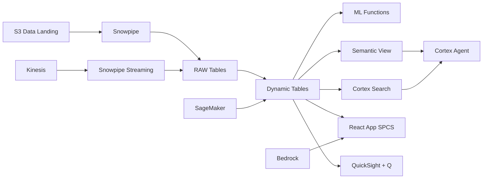

# CPO Trading Analytics

Real-time CPO trading intelligence for Indonesia's US$28B palm oil export market — ML.FORECAST projects price movements, Dynamic Tables build position books, and Cortex AI generates market commentary.

## Architecture

An Indonesian palm oil trading house manages US$2.8 billion in annual turnover across physical and derivative CPO/PKO markets. With 15,000 trades, fluctuating export levies, and vessels queuing at Belawan, the Head of Trading needs real-time position visibility and AI-generated market intelligence — not end-of-day spreadsheet reports.



## Snowflake Capabilities

| Capability | Implementation |
|-----------|---------------|
| Dynamic Tables | POSITION_BOOK / FORWARD_CURVE / LOGISTICS_STATUS / LEVY_IMPACT |
| ML Functions | ML.FORECAST |
| Cortex AI | COMPLETE, AI_EXTRACT, SUMMARIZE |
| Cortex Search | 300 documents indexed |
| Cortex Agent | TRADING_INTELLIGENCE_AGENT |
| Semantic View | TRADING_ANALYTICS |
| React App (SPCS) | 5 tabs + DemoGuide |


## AWS Services

| Service | Role in Demo |
|---------|-------------|
| Amazon Kinesis | Stream real-time market data and trade executions |
| Apache Iceberg (S3) | Open table format for counterparty position sharing |
| AWS Glue | ETL for trade reconciliation and position aggregation |
| Amazon SageMaker | Price prediction models for CPO forward curve |
| Amazon Bedrock (Claude) | Generate trading commentary and market intelligence summaries |
| Amazon QuickSight + Q | Trading desk dashboard with natural language queries |


## Personas

| Persona | Role | Key Questions |
|---------|------|---------------|
| **Harianto Gunawan** | Head of Trading | "What's our net CPO position and mark-to-market?" "Which counterparties are approaching credit limits?" |
| **Linda Tanjung** | Risk Analyst | "Show me the CPO forward curve vs physical premium." "What's our VaR at 95% confidence?" |


## Data

| Table | Rows | Description |
|-------|------|-------------|
| TRADES | 15,000 | Physical and derivative CPO/PKO trades with counterparty and pricing |
| POSITIONS | 5,000 | Net position by commodity, delivery month, and counterparty |
| MARKET_PRICES | 200,000 | BMD futures, Rotterdam CIF, FOB Belawan, and basis spreads |
| LOGISTICS | 10,000 | Vessel nominations, loading schedules, and shipment tracking |
| TRADE_DOCS | 300 | Contracts, letters of credit, shipping documents, and market reports |
| EXPORT_LEVY | 100 | Indonesian export levy and reference price history |


## Build Instructions

### Prerequisites
- Snowflake account with ACCOUNTADMIN access
- Cortex AI enabled (ML Functions, Search, Agent)
- Warehouse: TRADING_WH (Medium)
- AWS CLI with access (us-west-2)

### Deployment

```bash
snowsql -f snowflake/00_setup.sql
snowsql -f snowflake/01_marketplace_install.sql
snowsql -f snowflake/02_raw_tables.sql
snowsql -f snowflake/03_staging.sql
snowsql -f snowflake/04_dynamic_tables.sql
snowsql -f snowflake/05_search.sql
snowsql -f snowflake/06_ml_models.sql
snowsql -f snowflake/07_semantic_view.sql
snowsql -f snowflake/08_agent.sql
```

### React App (SPCS)
```bash
cd app && npm ci && npm run build
docker build -t aws-indonesia-palm-oil-trading-app .
docker push bdiqc8sm-default.registry.snowflakecomputing.com/palm_oil_trading/app/aws_indonesia_palm_oil_trading/app:latest
```

### Demo Mode
Open the app URL with `?demo=true` for presenter view.

## Build Modes

### Snowflake Only
Run scripts 00-08 (skip AWS-specific integration). Uses:
- **Snowpipe Streaming SDK** instead of Amazon Kinesis
- **Snowflake Managed Iceberg Tables** instead of Apache Iceberg (S3)
- **Dynamic Tables** instead of AWS Glue
- **ML.FORECAST** instead of Amazon SageMaker
- **Cortex Complete** instead of Amazon Bedrock (Claude)
- **Snowflake Intelligence (Cortex Analyst)** instead of Amazon QuickSight + Q

### Full AWS + Snowflake
Run all scripts including AWS integration. Deploy QuickSight dashboard from `quicksight/`.

## Business Impact

Industry research and Snowflake customer outcomes:
- **Indonesia exported US$28.5B in palm oil products in 2023 — world's largest exporter** — [BPS Indonesia](https://www.bps.go.id/)
- **CPO price volatility averaged 25% annualized in 2023 — highest in 5 years** — [BMD/Bursa Malaysia](https://www.bursamalaysia.com/trade/our-products-services/derivatives/commodity-derivatives)
- **Indonesian export levy changes can swing margins by 3-5% within a week** — [GAPKI](https://gapki.id/)
- **Real-time position management reduces trading losses by 15-20% vs end-of-day reporting** — [McKinsey Commodities](https://www.mckinsey.com/industries/metals-and-mining/our-insights)


## Key Demo Numbers

- **15,000 trades** physical and derivative across CPO/PKO markets
- **45,000t net long** CPO position across Q1-Q2 delivery months
- **Rp 23B** mark-to-market gain on current positions
- **200,000 prices** market data points (futures, physical, basis)
- **Rp 8.7B VaR** value-at-risk at 95% confidence
- **300 documents** trade contracts and market reports searchable


## License

Apache 2.0 — See [LICENSE](LICENSE) for details.

This is a personal demo project and is not an official Snowflake offering. It comes with no support or warranty.