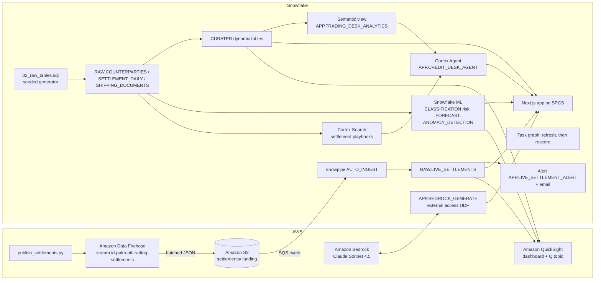

# Indonesia Palm Oil Trading - Buyer Settlement Risk and Trade Credit

End-to-end buyer settlement monitoring for **120 buyer counterparties of a fictional Indonesian palm oil trading desk across 5 port cities** (Dumai, Medan, Palembang, Pontianak, Balikpapan) using Snowflake, optionally with AWS: from a live late-settlement event to a 14-day late-settlement risk score, an alert email and an AI action memo for the trade-credit team. Buyers, contracts and amounts are synthetic; nothing here is a price view or trading advice.

## Architecture

A palm oil trading desk pipeline built on **Snowflake** (Dynamic Tables, Snowflake ML, Cortex Search, Cortex Agent, Cortex AI_COMPLETE, SPCS) and, in the full build, **AWS** (Amazon Data Firehose, S3, Bedrock Claude, QuickSight + Amazon Q). Settlement events land in `RAW.LIVE_SETTLEMENTS`. Dynamic tables curate 90 days of buyer-day history across five palm oil products (crude palm oil, RBD palm olein, RBD palm stearin, palm kernel oil and palm fatty acid distillate): settlements due and late, on-time settlement rate, share of open exposure more than 30 days overdue, payment-commitment rate and shipping-document coverage. Snowflake ML scores each buyer's probability of a late settlement in the next 14 days, forecasts desk-wide late settlements and flags letter-of-credit (LC) headroom drops. A Cortex Agent answers questions with settlement-playbook citations, and an LLM drafts the trade-credit action memo.

Interactive diagrams (hover for object names): [Snowflake only](docs/architecture-snowflake.html) | [AWS + Snowflake](docs/architecture-aws.html). The app shows both on its Architecture & Data tab, the current build first. Regenerate them with `python3 docs/build_architecture.py`.


```mermaid
flowchart LR
    subgraph AWS
      SIM[publish_settlements.py] --> FH[Amazon Data Firehose<br/>stream id-palm-oil-trading-settlements]
      FH -->|batched JSON| S3[(Amazon S3<br/>settlements/ landing)]
      BR[Amazon Bedrock<br/>Claude Sonnet 4.5]
      QS[Amazon QuickSight<br/>dashboard + Q topic]
    end
    subgraph Snowflake
      S3 -->|SQS event| PIPE[Snowpipe AUTO_INGEST] --> LIVE[RAW.LIVE_SETTLEMENTS]
      GEN[02_raw_tables.sql<br/>seeded generator] --> RAW[RAW.COUNTERPARTIES / SETTLEMENT_DAILY / SHIPPING_DOCUMENTS]
      RAW --> DT[CURATED dynamic tables]
      RAW --> ML[Snowflake ML<br/>CLASSIFICATION risk, FORECAST,<br/>ANOMALY_DETECTION]
      DT --> SV[Semantic view<br/>APP.TRADING_DESK_ANALYTICS]
      RAW --> CS[Cortex Search<br/>settlement playbooks]
      SV --> AG[Cortex Agent<br/>APP.CREDIT_DESK_AGENT]
      CS --> AG
      LIVE --> AL[Alert APP.LIVE_SETTLEMENT_ALERT<br/>+ email]
      UDF[APP.BEDROCK_GENERATE<br/>external access UDF]
      TK[Task graph: refresh, then rescore]
      APP[Next.js app on SPCS]
    end
    BR <--> UDF
    DT --> APP
    ML --> APP
    LIVE --> APP
    AG --> APP
    UDF --> APP
    DT --> QS
    ML --> QS
    LIVE --> QS
```

The Snowflake-only build drops the AWS subgraph: `APP.SIMULATE_SETTLEMENTS` writes to `RAW.LIVE_SETTLEMENTS`, and the app calls Cortex `AI_COMPLETE` instead of the Bedrock UDF.

## Snowflake Capabilities

| Capability | Implementation |
|-----------|---------------|
| Dynamic Tables | `CURATED.KPI_SUMMARY`, `PERFORMANCE_SUMMARY`, `PRODUCT_SUMMARY`, `TREND_ANALYSIS` from the RAW tables |
| Snowflake ML | CLASSIFICATION 14-day late-settlement risk (`ML.LATE_RISK_SCORES`), 14-day late-settlement FORECAST, LC headroom ANOMALY_DETECTION |
| Cortex Search | 15 synthetic settlement playbooks (5 products x 3 overdue stages) in `SEARCH.SETTLEMENT_SOP_SEARCH` |
| Semantic View | `APP.TRADING_DESK_ANALYTICS` over buyers, palm oil products, daily totals and risk |
| Cortex Agent | `APP.CREDIT_DESK_AGENT`: Cortex Analyst over the semantic view plus Cortex Search for playbook citations |
| Cortex AI | `AI_COMPLETE('claude-sonnet-4-5')` for grounded answers, and for the action memo in the Snowflake-only build |
| Alerts + Tasks | `APP.LIVE_SETTLEMENT_ALERT` logs LATE events and sends email; task graph `TASK_REFRESH_CURATED`, then `TASK_RESCORE_RISK` |
| Snowpark Container Services | Next.js app `APP.ID_PALM_OIL_TRADING_APP` with 6 tabs: Executive Cockpit, Predictive, Credit Desk, Live Settlements, Ask AI, Architecture & Data |
| Snowpipe | `RAW.LIVE_SETTLEMENTS_PIPE` AUTO_INGEST from S3 (AWS build only) |

## AWS Services

Used only in the AWS + Snowflake build.

| Service | Role in Demo |
|---------|-------------|
| Amazon Data Firehose | Direct PUT stream `id-palm-oil-trading-settlements` receives simulated settlement events and writes batches to S3 |
| Amazon S3 | Landing bucket (`settlements/`). An event notification goes to the Snowpipe SQS queue |
| Amazon Bedrock | Claude Sonnet 4.5 writes the action memo, called from Snowflake through an external-access UDF |
| Amazon QuickSight | DIRECT_QUERY executive dashboard over Snowflake (daily settlements, late settlements by counterparty, late-settlement risk) |
| Amazon Q | Natural-language questions over the QuickSight topic `id-palm-oil-trading-topic` |
| AWS IAM | Least-privilege roles for S3, Firehose and Bedrock |

## Personas

These personas are fictional.

| Persona | Role | Key Questions |
|---------|------|---------------|
| **Rina Siregar** | Head of Trade Credit | "What is our on-time settlement rate, and how much open exposure is more than 30 days overdue?" "Which palm oil products are slipping?" |
| **Bayu Hasibuan** | Settlement Operations Lead | "Which buyers are likely to settle late in the next two weeks, and which settlement playbook applies?" |

## Data

All data is synthetic and seeded, so every rebuild reproduces it. The trading desk, buyers, contracts and amounts are fictional; the cities are real Indonesian port cities used only as regions. Nothing describes a real company, plantation, mill or market price.

| Table | Rows | Description |
|-------|------|-------------|
| RAW.COUNTERPARTIES | 120 | Buyer counterparties across 5 port cities and 5 palm oil products (crude palm oil, RBD palm olein, RBD palm stearin, palm kernel oil, palm fatty acid distillate), with a synthetic internal credit score, contract value (USD) and a weekly or fortnightly settlement schedule |
| RAW.SETTLEMENT_DAILY | 10,800 | Daily buyer observations over 90 days: settlements due and late, invoice amounts due and settled (USD), days overdue, open exposure, credit-desk follow-ups, payment commitments, LC headroom and vessel nominations |
| RAW.SHIPPING_DOCUMENTS | 120 | Required, on-file and pending shipping and trade-finance documents per buyer (certificate of analysis, bill of lading, surveyor weight report, letter of credit, certificate of origin) |
| SEARCH.SETTLEMENT_DOCS | 15 | Synthetic settlement follow-up playbooks (5 products x 3 overdue stages) indexed for Cortex Search |
| RAW.LIVE_SETTLEMENTS | Grows during the demo | Live settlement events from Firehose (AWS build) or `APP.SIMULATE_SETTLEMENTS` (Snowflake-only build) |
| ML.LATE_RISK_SCORES | 120 | 14-day late-settlement probability and risk band per buyer |

## Build Instructions

### Prerequisites
- Snowflake account with ACCOUNTADMIN access, and Cortex AI enabled (AI_COMPLETE, Search, Agent).
- An X-Small warehouse with auto-suspend at or below 120 s, and an existing SPCS compute pool.
- Python 3.11+, `snowflake-connector-python`, Node.js 22+, Docker and the `snow` CLI.
- App image: create `APP.IMAGES` (`CREATE IMAGE REPOSITORY IF NOT EXISTS <DATABASE>.APP.IMAGES`), run `snow spcs image-registry login`, then build with `docker build --platform linux/amd64` and push `id-palm-oil-trading-app:v1` (see the header of `snowflake/07_deploy_app.sql`).
- AWS build only: `boto3`, AWS credentials for the target account (us-west-2) with Bedrock access, and QuickSight Enterprise.

### SPCS App
```
<DATABASE>.APP.ID_PALM_OIL_TRADING_APP
```

### Tests
```bash
python -m pytest aws snowflake quicksight
```

For a local run, put `SNOWFLAKE_ACCOUNT`, `SNOWFLAKE_USER`, `SNOWFLAKE_DATABASE`, `SNOWFLAKE_WAREHOUSE`, `SNOWFLAKE_AUTHENTICATOR=PROGRAMMATIC_ACCESS_TOKEN`, `SNOWFLAKE_TOKEN` and `DEMO_PLATFORM` in the environment, then run `npm --prefix app run build && npm --prefix app start`.

## Build Modes

Both modes share the same core. They differ in three places, and the app's `DEMO_PLATFORM` setting (in its SPCS spec) switches the memo provider and the Live Settlements tab.

| Layer | Snowflake Only | Full AWS + Snowflake |
|---|---|---|
| Live settlements | `CALL APP.SIMULATE_SETTLEMENTS(n)` inserts simulated settlement events into `RAW.LIVE_SETTLEMENTS`. This simulates a settlement feed; it is not Snowpipe Streaming | `aws/publish_settlements.py` to Amazon Data Firehose, then S3, SQS and Snowpipe AUTO_INGEST |
| Action memo | Cortex `AI_COMPLETE('claude-sonnet-4-5')` | Amazon Bedrock Claude Sonnet 4.5 through `APP.BEDROCK_GENERATE` |
| BI and natural-language questions | The SPCS app is the dashboard; questions go to the Cortex Agent | Also a QuickSight dashboard and an Amazon Q topic |
| App setting | `DEMO_PLATFORM: snowflake` | `DEMO_PLATFORM: aws` |

### Snowflake Only

```bash
# 1. Core data and dynamic tables (guarded: new isolated database only)
python snowflake/run_core.py --database INDONESIA_PALM_OIL_TRADING_SNOWFLAKE --warehouse <XS_WAREHOUSE> --connection <CONNECTION> --apply
# 2. Native settlement feed, ML, search, semantic view, agent, alert and task graph
python snowflake/run_intelligence.py --database INDONESIA_PALM_OIL_TRADING_SNOWFLAKE --platform snowflake --warehouse <XS_WAREHOUSE> --connection <CONNECTION> --alert-email you@example.com
# 3. App on SPCS with DEMO_PLATFORM=snowflake (push the image first)
python snowflake/run_intelligence.py --database INDONESIA_PALM_OIL_TRADING_SNOWFLAKE --platform snowflake --warehouse <XS_WAREHOUSE> --connection <CONNECTION> --alert-email you@example.com --files 07_deploy_app.sql --compute-pool <COMPUTE_POOL>
```

During the demo:
- Run `CALL APP.SIMULATE_SETTLEMENTS(20)` to add live settlement events. For a continuous feed, run `ALTER TASK APP.TASK_SIMULATE_SETTLEMENTS RESUME`, and `SUSPEND` it afterwards.
- Run `EXECUTE ALERT APP.LIVE_SETTLEMENT_ALERT` to raise the alert email.
- Run `EXECUTE TASK APP.TASK_REFRESH_CURATED` to refresh the curated tables and rescore risk.

Afterwards, drop the database or run `ALTER SERVICE APP.ID_PALM_OIL_TRADING_APP SUSPEND`.

### Full AWS + Snowflake

```bash
# 1. Core data and dynamic tables (guarded: new isolated database only)
python snowflake/run_core.py --database INDONESIA_PALM_OIL_TRADING_AWS --warehouse <XS_WAREHOUSE> --connection <CONNECTION> --apply
# 2. AWS ingestion and Bedrock (dry run first, then --apply)
python aws/setup_aws.py --database INDONESIA_PALM_OIL_TRADING_AWS --account <AWS_ACCOUNT_ID> --connection <CONNECTION> --apply
# 3. ML, search, semantic view, agent, alert and task graph
python snowflake/run_intelligence.py --database INDONESIA_PALM_OIL_TRADING_AWS --platform aws --warehouse <XS_WAREHOUSE> --connection <CONNECTION> --alert-email you@example.com
# 4. App on SPCS with DEMO_PLATFORM=aws (push the image first)
python snowflake/run_intelligence.py --database INDONESIA_PALM_OIL_TRADING_AWS --platform aws --warehouse <XS_WAREHOUSE> --connection <CONNECTION> --alert-email you@example.com --files 07_deploy_app.sql --compute-pool <COMPUTE_POOL>
# 5. QuickSight dashboard and Q topic (needs an existing Snowflake data source)
python quicksight/build_dashboards.py --database INDONESIA_PALM_OIL_TRADING_AWS --account <AWS_ACCOUNT_ID> --principal-arn <QUICKSIGHT_USER_ARN> --data-source-arn <DATA_SOURCE_ARN> --prefix id-palm-oil-trading --apply --update --with-topic
```

QuickSight objects must be shared with the QuickSight user who signs in (`--principal-arn`); otherwise the console shows nothing.

During the demo:
- Run `python aws/publish_settlements.py --count 20` to send live settlement events. Firehose buffers for up to 60 seconds before writing to S3.
- Run `EXECUTE ALERT APP.LIVE_SETTLEMENT_ALERT` to raise the alert email.
- Run `EXECUTE TASK APP.TASK_REFRESH_CURATED` to refresh the curated tables and rescore risk.

Afterwards, `python aws/teardown_aws.py --database INDONESIA_PALM_OIL_TRADING_AWS --account <AWS_ACCOUNT_ID> --connection <CONNECTION> --apply` removes the AWS resources and the account-level Bedrock external-access and S3 storage integrations. It leaves the email integration `ID_PALM_OIL_TRADING_EMAIL_INT`, which the Snowflake-only build also uses.

## Business Impact

Industry research and Snowflake customer outcomes:
- **Indonesia is the largest palm oil producer: 46.7 million metric tons, 57.3% of global production, in marketing year 2025** -- [USDA Foreign Agricultural Service: Production - Palm Oil](https://www.fas.usda.gov/data/production/commodity/4243000)
- **IGS Energy** (Snowflake customer, retail energy supplier that makes daily commodity purchasing decisions) moved from hundreds of thousands of individual forecasting models in Databricks to one unified model in Snowflake and cut training costs by 75% without sacrificing accuracy -- [Snowflake customer story: IGS Energy](https://www.snowflake.com/en/customers/all-customers/case-study/igs-energy/)

## Key Demo Numbers

These figures are synthetic and come from the seeded demo data. Forecast and anomaly figures can shift slightly with the build day.

- **120 buyer counterparties** across 5 port cities and 5 palm oil products; 10,800 buyer-days over 90 days; USD 537.7 m open exposure on the latest day
- **1,096 settlements due** and **197 late**, so the on-time settlement rate is 82.0%; USD 402.7 m settled
- **8.2% of open exposure is more than 30 days overdue**; palm kernel oil has the highest share (15.3%) and RBD palm stearin the lowest on-time rate (69.1%)
- **Balikpapan** has the lowest on-time settlement rate of the 5 port cities (77.7%); Pontianak is at 81.3% after a 15-day loading-delay shock in the data
- **Late-settlement model** out-of-time holdout: precision 0.38, recall 0.24 at a 0.5 threshold, against a 0.22 base rate. 19 buyers are high risk; the top buyer is BUY-0101, at 99.4%
- **14-day late-settlement forecast** with prediction intervals; **244 LC headroom drops** flagged across 42 buyers in the last 15 days
- **541 credit-desk follow-ups** with a 43.6% payment-commitment rate; document coverage 60.4%, with 61 documents pending
- **15 playbooks** indexed for Cortex Search and cited by ID in agent answers

## License

Apache 2.0 — See [LICENSE](LICENSE) for details.

This is a personal demo project and is not an official Snowflake offering. It comes with no support or warranty. Industry metrics cited are from publicly available third-party research and Snowflake customer stories; they represent reported outcomes and are not guarantees of results.
